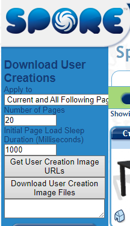

# Sporepedia-Batch-Downloader
This is a forked [gist](https://gist.github.com/Just-Harry/eef89a0592aded07ccbcfe6a89ad05d1) created by [Just-Harry](https://gist.github.com/Just-Harry) that allows you to mass
download Spore adventures, creatures, buildings, vehicles, etc from [Sporepedia](https://www.spore.com/sporepedia)

## Installation 
You need to download the TamperMonkey extension for your browser: https://chrome.google.com/webstore/detail/tampermonkey/dhdgffkkebhmkfjojejmpbldmpobfkfo
and then import the UserScript into it.

## Usage 
* Set Spore to Windowed Mode (disable Fullscreen in Video Settings)

* Go to [Sporepedia](https://www.spore.com/sporepedia) and filter the search to what you plan to download
* On the top left you should see an injected control panel 
* 

* Download with desired settings. 

* Drag all the downloaded files onto the Spore window
